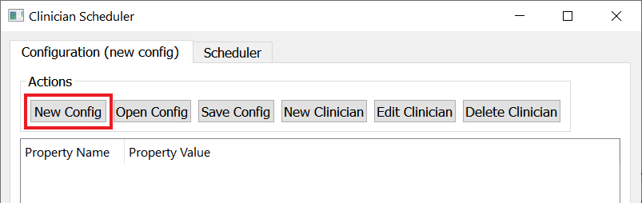
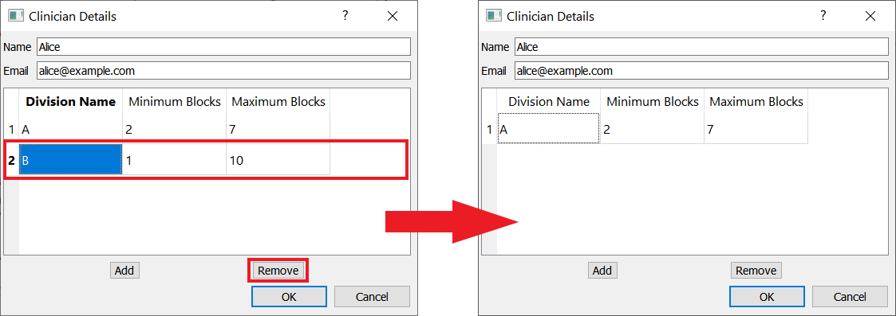
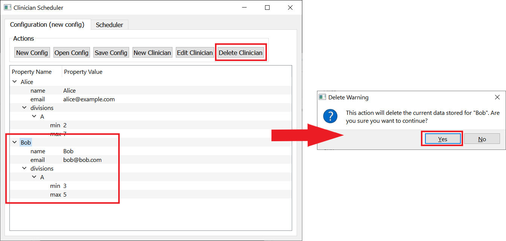
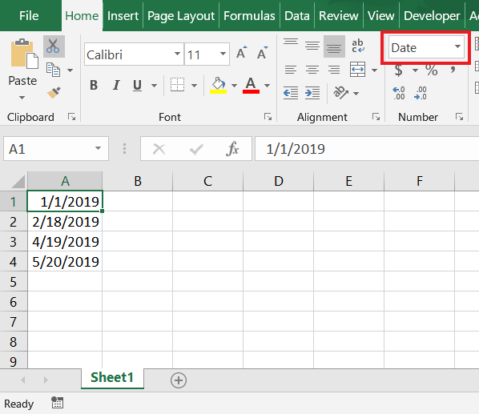
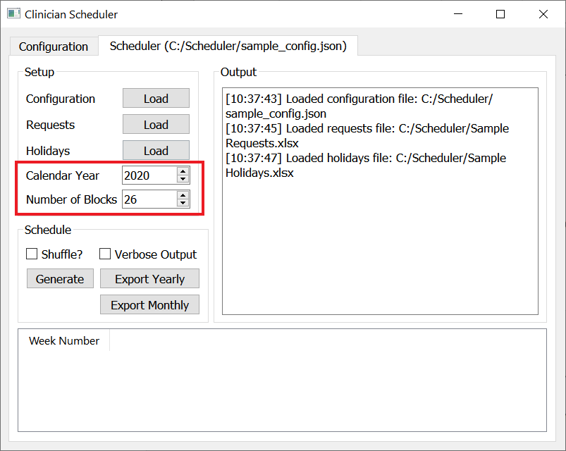
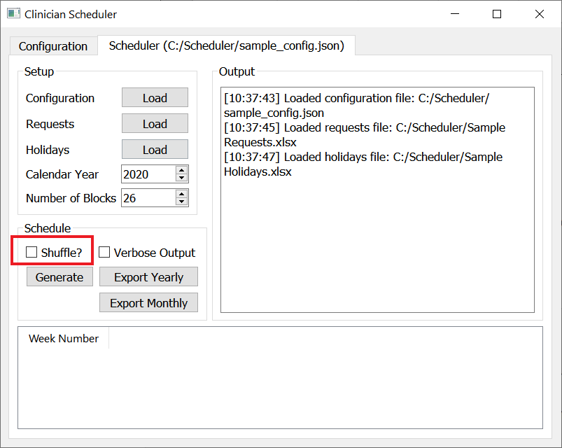
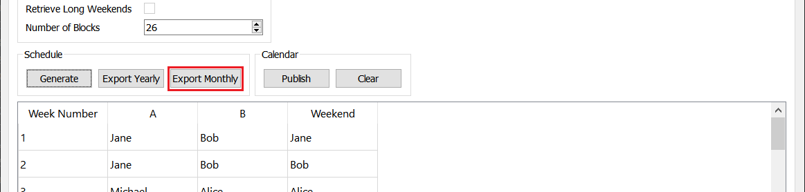
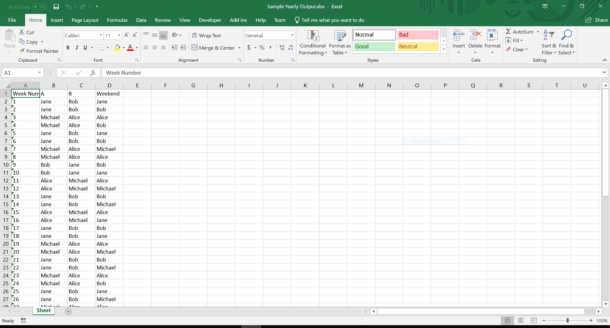

.. Clinician Scheduler documentation master file, created by
   sphinx-quickstart on Thu Jan 10 13:28:57 2019.
   You can adapt this file completely to your liking, but it should at least
   contain the root `toctree` directive.

User Manual
===========

.. .. contents:: Table of Contents
..    :backlinks: none

.. _clinician-configuration:

Clinician Configuration
"""""""""""""""""""""""

The clinician configuration specifies which clinicians are available,
which divisions they are covering, and how many weeks they should cover
in each of their divisions.

Creating a new configuration file
~~~~~~~~~~~~~~~~~~~~~~~~~~~~~~~~~

By default, you will get a blank configuration file when you launch
the program. If you would like to discard the changes you have made and 
start a configuration file from scratch, simply click on `New Config`.

.. warning::
   Unsaved changes to a configuration file will be discarded upon clicking
   on `New Config`.

Saving the configuration file
~~~~~~~~~~~~~~~~~~~~~~~~~~~~~

When you are ready to save the configuration you created, click on 
`Save Config` and choose a place to save your file. Make note of the name
and directory of the file so you could load it in future runs.

.. figure:: _static/images/configuration/save_config.png
   :class: with-border
   :target: _static/images/configuration/save_config.png

Loading a configuration file
~~~~~~~~~~~~~~~~~~~~~~~~~~~~

If you would like to open a previously created configuration file, simply
click on `Open Config`, navigate to the location of the file,
and select it.

.. figure:: _static/images/configuration/load_config.png
   :class: with-border
   :target: _static/images/configuration/load_config.png

.. _adding-a-new-clinician:

Adding a new clinician
~~~~~~~~~~~~~~~~~~~~~~

1. From the configuration tab, click `New Clinician`. You should see a
form for supplying clinician details.

.. figure:: _static/images/configuration/add_clinician/step1_new_clinician.png
   :class: with-border
   :target: _static/images/configuration/add_clinician/step1_new_clinician.png

2. Fill out the name, email (optional), and divisions that the clinician
   will be covering. To add a division you can click on `Add` and a new row 
   will be added to the table which you can fill out. You can set the minimum
   and maximum number of blocks that a clinician can work in a given division. 

.. note::
    A single block corresponds to two weeks.

.. figure:: _static/images/configuration/add_clinician/step2_add_division.png
   :class: with-border
   :target: _static/images/configuration/add_clinician/step2_add_division.png

3. To delete a row from the table, select the row and then click `Remove`.

4. When you are finished entering the data for the clinician, click `Ok`.
   You should now see a new entry in the main table for that clinician.

.. figure:: _static/images/configuration/add_clinician/step4_add_clinician.png
   :class: with-border
   :target: _static/images/configuration/add_clinician/step4_add_clinician.png

Deleting an existing clinician
~~~~~~~~~~~~~~~~~~~~~~~~~~~~~~

To delete an existing clinician, simply select a row corresponding
to the clinician in the table and click on `Delete Clinician`.

Editing an existing clinician
~~~~~~~~~~~~~~~~~~~~~~~~~~~~~

To edit the information of a clinician, select a row corresponding
to the clinician in the table and click on `Edit Clinician`. You should
see a dialog window where you can change the information. For more 
details on how to enter data in the edit dialog, see :ref:`adding-a-new-clinician`.

.. figure:: _static/images/configuration/edit_clinician.png
   :class: with-border
   :target: _static/images/configuration/edit_clinician.png

.. _requests_and_holidays:

Requests & Holiday Weekends
"""""""""""""""""""""""""""

Clinician requests for time-off and the dates of holiday weekends are 
supplied using a pair of excel files.

Clinician Requests Excel File
~~~~~~~~~~~~~~~~~~~~~~~~~~~~~

The requests file should have a single sheet per clinician that is in the
configuration file you created in :ref:`clinician-configuration`. Inside
each sheet, each request is entered on a separate row, containing the start
and end date (inclusive) of the request. 

.. warning::
    Make sure each value in the Excel file is formatted as a date!

.. figure:: _static/images/requests_holidays/excel_requests.png
   :class: with-border
   :target: _static/images/requests_holidays/excel_requests.png

.. note::
    To enter a request for a single day, use the same value for both start 
    and end date.

Holiday Weekends Excel File
~~~~~~~~~~~~~~~~~~~~~~~~~~~

The holiday weekends file should have a single sheet with the dates of the
holiday weekends, one in each row.

.. warning::
    Make sure each value in the Excel file is formatted as a date!

Scheduling
""""""""""

.. _generating-a-schedule:

Generating a schedule
~~~~~~~~~~~~~~~~~~~~~
Once you have created a configuration file, you can switch over to the 
`Scheduler` tab of the application in order to generate a schedule.

1. Load the configuration, requests, and holidays files that you created
   earlier in :ref:`clinician-configuration` and :ref:`requests_and_holidays`.

.. note::
    You can be sure that everything loaded correctly by checking the output
    on the right.

.. figure:: _static/images/scheduling/generate_schedule/step1_load.png
   :class: with-border
   :target: _static/images/scheduling/generate_schedule/step1_load.png

2. Set the starting calendar year for the schedule, as well as the number 
   of 2-week blocks that you want the schedule to cover. By default, the calendar
   year is the upcoming year, and the number of blocks is 26, to cover a full 
   year.

3. **(Optional)** Check the `Shuffle?` checkbox if you would like the scheduler
   to generate a slightly different schedule each time you click on `Generate`.

4. **(Optional)** Check the `Verbose Output` checkbox if you would like 
   to see detailed output on the right after the scheduler finishes generating
   the schedule.

.. figure:: _static/images/scheduling/generate_schedule/step4_optional_verbose.png
   :class: with-border
   :target: _static/images/scheduling/generate_schedule/step4_optional_verbose.png

5. Click on `Generate` to generate a schedule.

.. figure:: _static/images/scheduling/generate_schedule/step5_generate.png
   :class: with-border
   :target: _static/images/scheduling/generate_schedule/step5_generate.png

.. warning::
   Depending on the amount of clinicians and requests provided, it may take
   some time to find an optimal schedule. 

.. warning::
   It is possible that the scheduler will not be able to come up with a 
   schedule that satisfies your constraints. This can be a result of one
   or more of the following reasons:
   
   - There are not enough clinicians to distribute evenly throughout the year
   - The specified constraints are too restrictive
   - The minimum and maximum number of blocks of clinicians are too restrictive

   In these situations try the following:

   1. Adjust the constraints in the `Settings` tab, starting from the 
      most restrictive constraints. See :ref:`changing-settings`
   2. Try changing the configuration file by adding new clinicians, or 
      changing the min/max blocks of existing clinicians to allow for 
      more flexibility. See :ref:`clinician-configuration`

.. _changing-settings:

Changing settings
~~~~~~~~~~~~~~~~~
The `Settings` tab allows you to modify the constraints applied when
generating a potential schedule.

In order to disable/enable a constraint, uncheck/check the 
corresponding checkbox and re-generate the schedule in the `Scheduler`
tab (see :ref:`generating-a-schedule`).

.. figure:: _static/images/scheduling/settings_tab.png
   :class: with-border
   :target: _static/images/scheduling/settings_tab.png

St. Michael's Hospital (SMH) Constraints 
****************************************
The following descriptions are specific to the SMH version of the 
scheduler (that is, the :code:`scheduler-smh.exe` executable file)

.. note::
   The following constraints are presented in order of restrictiveness,
   from least restrictive to most restrictive.
   
   If you are struggling to generate a schedule, try disabling them,
   starting from the latter constraints.

- **Cover All Block & Weekends**
   This constraint enforces that a clinician is assigned to every block
   and weekend, in every department.
- **Restrict Min/Max Blocks**
   This constraint enforces that a clinician is assigned to a number
   of blocks no less than their specified minimum and no more than
   their specified maximum.
- **Balance Weekends**
   This constraint enforces that all clinicians are assigned to an 
   approximately equal number of weekends
- **Balance Long Weekends**
   This constraint enforces that all clinicians are assigned to an 
   approximately equal number of long (holiday) weekends
- **Prevent Consecutive Blocks**
   This constraint enforces that a clinician is not assigned to two
   consecutive blocks in a row
- **Spread Out Blocks**
   This constraint enforces that a clinician is not assigned to more than
   2 blocks in every 5 consecutive blocks.
- **Spread Out Weekends**
   This constraints enforces that a clinician is not assigned to more than
   1 block in every 4 consecutive blocks.

Exporting a schedule
~~~~~~~~~~~~~~~~~~~~

If you are satisfied with the generated schedule, you can choose to export
it as an Excel file. There are two Excel format options: `Yearly Export` and 
`Monthly Export`. 

Selecting the `Yearly Export` option will generate an excel file with a single
sheet, displaying the clinicians that are covering a particular division
for a given week or weekend. It is very similar to the table output in
the application itself.

.. figure:: _static/images/scheduling/export_schedule/export_yearly.png
   :class: with-border
   :target: _static/images/scheduling/export_schedule/export_yearly.png

Selecting the `Monthly Export` option will generate a more detailed breakdown
of the schedule, with a separate sheet for every month, detailing which
clinician covers which division on which day.

Sample Output
"""""""""""""

Yearly Excel Format
~~~~~~~~~~~~~~~~~~~

Monthly Excel Format
~~~~~~~~~~~~~~~~~~~~

.. figure:: _static/images/scheduling/sample_monthly.png
   :class: with-border
   :target: _static/images/scheduling/sample_monthly.png